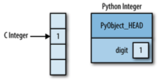
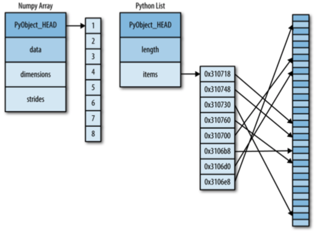
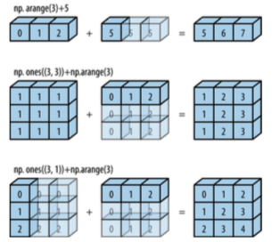

# Python Data Science Handbook
(by Jake VanderPlas, <https://jakevdp.github.io/PythonDataScienceHandbook/>)

## Preface

Data Science comprises of three distinct and overlapping skills:

* Statistician: how to model and summarize datasets  
* Computer Scientist: design and use algorithms to efficiently store, process, and visualize data  
* Domain Expert: formulates the right questions and puts their answers in context

Large and active ecosystem of third-party Python packages:

* NumPy: manipulation of homogenous array-based data  
* Pandas: manipulation of heterogenous and labeled data  
* SciPy: common scientific computing tasks  
* Matplotlib: publication-quality visualizations  
* IPython: interactive execution and sharing of code  
* Scikit-Learn: machine learning  

## IPython: Beyond Normal Python

### `?` shortcut for accessing documentation:

```
In [2]: len?
Type:        builtin_function_or_method
String form: <built-in function len>
Namespace:   Python builtin
Docstring:
len(object) -> integer

Return the number of items of a sequence or mapping.
```

```
In [5]: L?
Type:        list
String form: [1, 2, 3]
Length:      3
Docstring:
list() -> new empty list
list(iterable) -> new list initialized from iterable's items
```

### `??` shortcut for accessing source code:

```
In [8]: square??
Type:        function
String form: <function square at 0x103713cb0>
Definition:  square(a)
Source:
def square(a):
    "Return the square of a"
    return a ** 2
```

### TAB completion:

```
In [10]: L.<TAB>
L.append   L.copy     L.extend   L.insert   L.remove   L.sort     
L.clear    L.count    L.index    L.pop      L.reverse
```
### Interacting with shell:

Anything appearing after `!` on a line will be executed not by the Python kernel, but by the system command line. You can also save the output:

```
contents = !ls
```

### IPython magic commands:

* `%time`: Time the execution of a single statement
* `%timeit`: Time repeated execution of a single statement for more accuracy
* `%prun`: Run code with the profiler
* `%lprun`: Run code with the line-by-line profiler
* `%memit`: Measure the memory use of a single statement
* `%mprun`: Run code with the line-by-line memory profiler


## Introduction to NumPy

Every Python object is simply a disguised C structure. A single integer in Python 3.4 is:

* `ob_refcnt`: a reference count that helps Python silently handle memory allocation and deallocation
* `ob_type`: encodes the type of the variable
* `ob_size`: specifies the size of the following data members
* `ob_digit`: contains the actual integer value that the Python variable represents



To allow flexible types, each item in a list must contain its own type info, reference count, and other information - that is, each item is a complete Python object. At the implementation level, a fixed-type NumPy array contains a single point to one continuous block of data. The Python list, on the other hand, contains a pointer to a block of pointers, each of which points to a full Python object.



While Python's `array` object provides efficient storage of array-based data, NumPy adds to this efficient operations on that data.

### Initialization:
```
np.array([1, 4, 2, 5, 3])
```

NumPy is constrained to arrays that all contain the same type. If types do not match, NumPy will upcast if possible.

NumPy arrays can explicity by multidimensional:
```
np.array([range(i, i+3) for i in [2, 4, 6]])
```

Creating arrays:
```
np.zeros(10, dtype=int)
```
```
np.ones((3,5), dytpe=float)
```
```
np.full((3, 5), 3.14)
```
```
np.arange(0, 20, 2)
```
```
np.random.random((3,3))
```
```
np.random.randint(0, 10, (3, 3))
```

Each array has attributes:

* `ndim`: the number of dimensions
* `shape`: the size of each dimension
* `size`: the total size of the array
* `dtype`: the data type of the array
* `itemsize`: lists the size (in bytes) of each array element
* `nbytes`: the total size (in bytes) of the array

### Slicing:

`x[start:stop:step]`

Multidimensional slices work in the same way, with multiple slices separated by commas.

Access single rows or columns of an array by combining indexing and slicing using an empty slice marked by a single colon (:) :
`x[:, 0]`

Array slices return *views* rather than *copies* of the array data. If we modify the subarray, the original array is changed. This default behavior is actually quite useful: it means that when we work with large dataasets, we can access and process pieces of these datasets without the need to copy the underlying data buffer.

### UFuncs:

NumPy provides a convenient interface into a kind of statically typed, compiled routine. This is known as a *vectorized* operation. It is performing an operation on the array, which will then be applied to each element. This vectorized approach is designed to push the loop into the compiled layer that underlies NumPy, leading to much faster execution. Vectorized operations in NumPy are implemented via *ufuncs*, whose main purpose is to quickly execute repeated operations on values in NumPy arrays. Ufuncs exist in two flavors: *unary ufuncs*, which operate on a single input, and *binary ufuncs*, which operate on two inputs.

For large calculations, it is sometimes useful to be able to specify the array where the result of the calculation will be stored. Rather than creating a temporary array, you can use this to write computation results directly to the memory location where you'd like them to be.

```
x = np.arange(5)
y = np.empty(5)
np.multiply(x, 10, out=y)
```

### Broadcasting

Another means of vectorizing operations is to use NumPy's *broadcasting* functionality. Broadcasting is simply a set of rules for applying binary ufuncs on arrays of different sizes.



Rules of Broadcasting:

1. If the two arrays differ in their number of dimensions, the shape of the one with fewer dimensions is *padded* with ones on its leading (left) side.
2. If the shape of the two arrays does not match in any dimension, the array with shape equal to 1 in that dimension is stretched to match the other shape.
3. If in any dimension the sizes disagree and neither is equal to 1, an error is raised.

### Masks

Masking occurs when you want to extract, modify, count, or otherwise manipulate values in an array based on some criterion.

NumPy implements comparison operators such as `<` and `>` as element-wise ufuncs. The result of these comparison operators is always an array with a Boolean data type.

```
x = np.array([1, 2, 3, 4, 5])
# Results in Boolean array
print(x < 3)
```

To select values from the array, we can simply index on this Boolean array; this is known as a masking operation:

```
x[x < 5]
```

What is returned is a 1D array filled with all the values that meet this condition; in other words, all the values in positions at with the mask array is True.

### Fancy Indexing

Fancy indexing is like simple indexing, but we pass arrays of indices in place of single scalars. This allows us to very quickly access and modify complicated subsets of an array's values. It is passing an array of indices to access multiple array elements at once.

```
x = rand.randint(100, size=10)
```

Could access three elements like:

```
x[x[3], x[7], x[2]]
```

Or pass an array of indices:

```
ind = [3, 7, 4]
x[ind]
```

With fancy indexing, the shape of the result reflects the shape of the index arrays rather than the shape of the array being indexed. Fancy indexing also works in multiple dimensions.

Conceptually, `x[i] += 1` is meant as a shorthand of `x[i] = x[i] + 1`. `x[i] + 1` is evaluated, and then the result is assigned in `x`. With this in mind, it is not the augmentation that happens multiple times, but the assignment.

The `at()` method does an in-place application of the given operator at the specified indices with the specified value

`np.add.at(x, i, 1)`

### Sorting arrays

By default, `np.sort` uses an `O[NlogN]`, quick-sort algorithm.

`argsort` returns indices of the sorted elements.

Sort along specific rows or columns of a multidimensional array using the `axis` argument.

`np.partition` takes an array and a number `K`; the result is a new array with the smallest `K` values to the left of the partition, and the remaining values to the right, in arbitrary order.

### Nearest Neighbor

When doing ver large nearest-neighbor searches, there are tree-based and/or approximate algorithms that can scale as O[N log N] or better rather than the O[N^2] of the brute-force algorithm. Example: KD-Tree.

### Big-O Notation
Big-O notation is a means of describing how the number of operations required for an algorithm scales as the input grows in size. The big-O notation by itself tells you nothing about the actual wall-clock time of a computation, but only about its scaling as you change N.