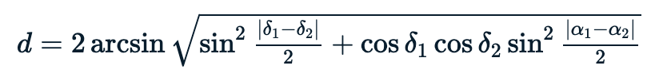
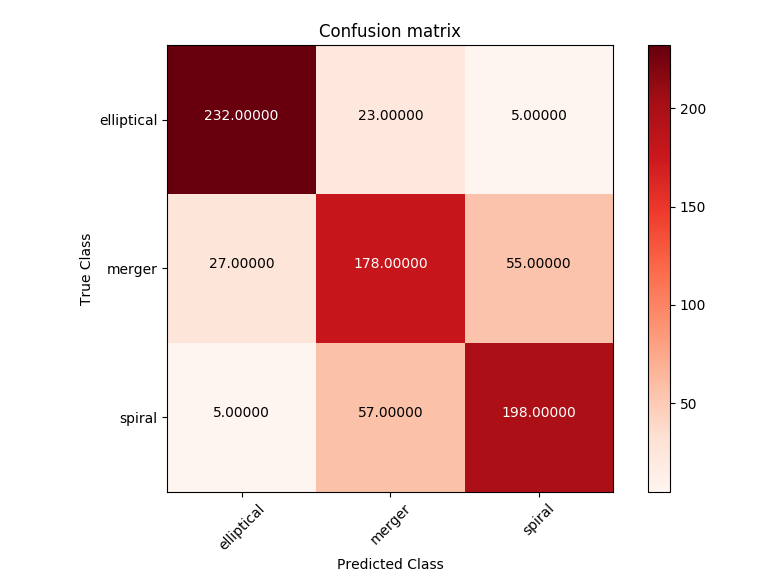

# Data Driven Astronomy Course Notes
## Week 1: Thinking About Data

The median can be a more robust measure of the average trend of datasets than the mean, as the latter is easily skewed by outliers.

Calculating the median requires all the data to be in memory at once. This is not an issue for calculating the mean.
It is impossible to do an exact "running" median, but it is possible to approximate.

### Binapprox algorithm:
* List of n numbers between x and y.  
* Create a histogram by placing each number in a bin x...y.  
* Starting from the first bin, if we sum the counts in the bins until we get just over `n+1/2`, then the last bin added (to the sum) must contained the median.  
* Choose the midpoint of that bin.  


#### Pseudocode:
```
μ = mean
σ = standard deviation

minval = μ - σ
maxval = μ + σ
// any value >= maxval is ignored

width = 2σ/B
ignore_bin // value < minval
// Make B bins for counting values in minval and maxval
// 		first bin is minval <= value < minval + width

// Count the number of values in each bin

// Sum until total >= (N + 1)/2 (starting with ignore bin)
// Return the midpoint of the bin that exceeded (N + 1)/2
```

#### Downside to binapprox:
Answer is only accurate to `σ/B`. Must keep `B` large enough that this isn't a problem.

## Week 2: Big Data Makes Things Slow

Equatorial coordinates are fixed relative to the celestial sphere, so the positions are independent of when or where the observations took place. They are defined relative to the celestial equator and the ecliptic. A point on the celestial sphere is given by two coordinates:
Right ascension: the angle from the vernal equinox to the point, going east along the celestial equator,
Declination: the angle from the celestial equator to the point, going north (negative values indicate going south).

RA usually given in hours-minutes-seconds (HMS) notation.
Full circle = 24 hours -> 1 hour in HMS = 15 degrees

Declination usually given in degrees-minutes-seconds (DMS) notation

### Haversine formula:
Calculating the angular distance between two objects on the celestial sphere:

`(α1, δ1) = RA and declination of object 1`

`(α2, δ2) = RA and declination of object 2`



### Crossmatching using k-d trees
(<https://en.wikipedia.org/wiki/K-d_tree>)

**Crossmatching** - comparing objects in one catalogue to objects in another to find the closest match.

Astropy constructs a k-d tree out of the second catalogue, letting it search through for a match for each object in the first catalogue efficiently. Constructing a k-d tree is similar to binary search. The k-dimensional space is divided into two parts recursively until each division contains only a single object.

Creating a k-d tree from an astronomy catalogue:

1. Find the object with the median right ascension, split the catalogue into objects left and right partitions of this.
2. Find the objects with the median declination in each partition, split the partitions into smaller partitions of objects down and up of these.
3. Find the objects with median right ascension in each of the partitions, split the partitions into smaller partitions of objects left and right of these.
4. Repeat 2-3 until each partition only has one object in it.

This creates a binary tree where each object used to split a partition (a node) links to the two objects that then split the partitions it has created (its children).

Once you've made a k-d tree out of a catalogue, finding a match to an object then works like this:

1. Calculate the distance from the object to highest level node (the root node), then go to the child node closest (in righ ascension) to the object.
2. Calculate the distance from the object to this child, then go to the child node closest (in declination) to the object.
3. Calculate the distance from the object to this child, then go to the child node closest (in right ascension) to the object.
4. Repeat 2-3 until you reach a child node with no further children (a leaf node).
5. Find the shortest distance of all distances calculated, this corresponds to the closest object.

Since each node branches into two children, a catalogue of `N` objects will have, on average, `log2(N)` nodes from the root to any leaf. So while it seems like a lot of effort to create a k-d tree, doing so lets you, for example, search the entire SuperCOSMOS catalogue of 250 million objects using only 28 distance calculations.

```python
data = np.loadtxt(csv, delimiter=',', usecols=(0,2))
return data[data[:, 1]>1, :]
```

Explanation:
An operation like `array > value` returns an array with boolean values which evaluate to True for all indices whose element fulfill the condition. Then, if we pass this boolean array to a second array, the second array gets filtered and only those rows which are `True` in the first array remain.

Example:

```python
import numpy as np
a = np.array([2, 1, 3]) > 1
b = np.array([3, 4, 2])
print(b[a])
```

## Week 3: Querying Your Data and Week 4: Managing Your Data

### SQL Notes:

Use `BETWEEN` for range queries:

```
SELECT radius FROM Star
WHERE radius BETWEEN 1 AND 2;
```

Use `COUNT` to only return the number of rows in the table requested.

```
SELECT COUNT(*) FROM Planet;
```

Other aggregate functions:
`MIN`, `MAX`, `SUM`, `AVG`, `STDDEV`

```
SELECT MIN(radius), MAX(radius), AVG(radius) FROM Planet;
```

Use `ORDER BY` for sort order.

```
SELECT koi_name, radius FROM Planet
ORDER BY radius DESC
LIMIT 5;
```

`GROUP BY` arranges identical data in groups on which we can perform aggregate functions.

```
SELECT radius, COUNT(koi_name)
FROM Planet
GROUP BY radius;
```

Returns a table which is grouped by the planet radii and contains the radii and the number of koi_names belonging to each radius.

In order to use aggregate functions in our conditions, we require the `HAVING` statement instead of `WHERE`, which gets called after the `GROUP BY` clause.

```
SELECT radius, COUNT(koi_name)
FROM Planet
GROUP BY radius
HAVING COUNT(koi_name) > 1;
```

```
SELECT kepler_id, COUNT(koi_name)
FROM Planet 
GROUP BY kepler_id
HAVING COUNT(koi_name) > 1
ORDER BY COUNT(koi_name) desc;
```

There are several ways to join data from multiple tables in SQL, the simplest one is called an equi-join. An equi-join usually tests for equality on attributes shared across tables. The condition in the WHERE clause is also called a join condition, it specifies how the data is to be joined. By taking this condition out, we've transformed our equi-join into a cross- or cartesian-join.

`JOIN ... USING`:
Specifying a field of attribute to test for equality

`JOIN ... ON`:
Specifying a condition

Inner joins: data is combined only when the specified condition is true.

Outer joins: table rows can be combined even if there is no match found to fulfill the join condition. We distinguish between three types of outer joins:

```
<table1> LEFT OUTER JOIN <table2>
```
Here all rows from `<table1>` are kept and missing matches from `<table2>` are replaced with NULL values.

```
<table1> RIGHT OUTER JOIN <table2>
```
All rows from `<table2>` are kept and missing matches from `<table1>` are replaced with NULL values.

```
<table1> FULL OUTER JOIN <table2>
```
All rows from both tables are kept.


We distinguish between two types of subqueries:

* Co-related: the subquery is executed for each element of the outer query.  
* Non-co-related: the subquery is executed only once.

Examples:

```
SELECT s.kepler_id
FROM Star s
WHERE EXISTS (
  SELECT * FROM Planet p
  WHERE s.kepler_id = p.kepler_id
    AND p.radius < 1
);
```

This is a co-related subquery. We select each row in `Star` where the corresponding `kepler_id` in `Planet` is a planet with radius smaller than 1. We may have to query the `Planet` table for each row in `Star` and check if the result is not empty using `EXISTS`.

Non-co-related query:

```
SELECT s.kepler_id
FROM Star s
WHERE s.kepler_id IN (
  SELECT p.kepler_id FROM Planet p
  WHERE p.radius < 1
);
```

Here we generate a table with the `kepler_id`s of all planets with a `radius` smaller than one, and then we check for each star if its `kepler_id` is contained in the returned `Planet` table. We query the `Planet` table only once.

```
CREATE TABLE <tablename> (
  <attribute1>  <type1>(size1) <constraint1>,
  <attribute2>  <type2>(size2) <constraint2>,
  ...
);
```

Common Data Types:

* `SMALLINT`	Signed two-byte integer  
* `INTEGER`		Signed four-byte integer  
* `FLOAT`		Eight-byte floating-point number  
* `CHAR(n)`		Fixed-length string with n characters  
* `VARCHAR(n)`	Variable-length string with maximum n characters

Example:

```
CREATE TABLE Star (
  kepler_id INTEGER,
  t_eff INTEGER,
  radius FLOAT
);
INSERT INTO Star VALUES
  (10341777, 6302, 0.815);
```

Constraint Types:

* `NOT NULL`	Value cannot be NULL  
* `UNIQUE`		Value must be unique in the table  
* `DEFAULT`		Specifies a default if the field is left blank  
* `CHECK`		Ensures that the value meets a specific condition  
* `PRIMARY KEY`	Combination of NOT NULL and UNIQUE  
* `FOREIGN KEY`	Ensures the data matches the specified attribute in another table  

```
Example:
CREATE TABLE Star (
  kepler_id INTEGER PRIMARY KEY,
  t_eff INTEGER CHECK (t_eff > 3000),
  radius FLOAT
);
```

A foreign key links data shared between two or more tables, thereby enforcing referential integrity. An attribute with a foreign key constraint is linked to an attribute in another table.

It can only be filled with a value that exists in the other table.
Example:

```
CREATE TABLE Star (
  kepler_id INTEGER PRIMARY KEY
);

CREATE TABLE Planet (
  kepler_id INTEGER REFERENCES Star (kepler_id)
);
```

```
INSERT INTO Star VALUES (10341777);
INSERT INTO Planet VALUES (10341777);
```

```
ALTER TABLE <tablename>
ADD COLUMN <columnname> <datatype> <modifiers>;

ALTER TABLE <tablename>
DROP COLUMN <columnname>;
```

```
ALTER TABLE Star
ADD COLUMN ra FLOAT,
ADD COLUMN decl FLOAT;

ALTER TABLE <tablename>
ALTER COLUMN <columnname> SET DATA TYPE <newtype>;

ALTER TABLE <tablename>
ADD CONSTRAINT <columnname> <newconstraint>;
```

## Week 5: Learning From Data: Regression

Flux magnitudes are the total flux (or light) received in five frequency bands (`u`, `g`, `r`, `i` and `z`).
The astronomical colour (or colour index) is the difference between the magnitudes of two filters, i.e. `u-g` or `i-z`.
This index is one way to characterise the colours of galaxies. For example, if the `u-g` index is high then the object is brighter in ultra violet frequencies than it is in visible green frequencies.
Colour indices act as an approximation for the spectrum of the object and are useful for classifying stars into different types.

To calculate the redshift of a distant galaxy, the most accurate method is to observe the optical emission lines and measure the shift in wavelenth. However, this process can be time consuming and is thus infeasible for large samples. For many galaxies we simply don't have spectroscopic observerations. Instead, we calculate the redshifts by measuring the flux using a number of different filters and comparing this to models of what we expect galaxies to look like at different redshifts.

### Decision trees
Decision trees are a tool that can be used for both classification and regression. Decision trees map a set of input features to their corresponding output targets. This is done through a series of individual decisions where each decision represents a node (or branching) of the tree.

The inputs to our decision tree are the colour indices from photometric imaging and our output is a photometric redshift.

Setting columns in a numpy array:

```python
features = np.zeros((data.shape[0], 4))
features[:, 0] = data['u'] - data['g']
```

In regression, we compare the predictions generated by our model with the actual values to test how well our model is performing. The difference between the predicted values and actual values (sometimes referred to as residuals) can tell us a lot about where our model is performing well and where it is not.

There a few different ways to characterise these differences. One way is the median of the differences between our predicted and actual values:

<math xmlns="http://www.w3.org/1998/Math/MathML" display="block">
  <mi>m</mi>
  <mi>e</mi>
  <mi>d</mi>
  <mi mathvariant="normal">&#x005F;<!-- _ --></mi>
  <mi>d</mi>
  <mi>i</mi>
  <mspace width="-0.1em" />
  <mi>f</mi>
  <mspace width="-0.1em" />
  <mi>f</mi>
  <mo>=</mo>
  <mi>m</mi>
  <mi>e</mi>
  <mi>d</mi>
  <mi>i</mi>
  <mi>a</mi>
  <mi>n</mi>
  <mo stretchy="false">(</mo>
  <mrow class="MJX-TeXAtom-ORD">
    <mo stretchy="false">|</mo>
  </mrow>
  <msub>
    <mi>Y</mi>
    <mrow class="MJX-TeXAtom-ORD">
      <mi mathvariant="normal">i</mi>
      <mo>,</mo>
      <mi mathvariant="normal">p</mi>
      <mi mathvariant="normal">r</mi>
      <mi mathvariant="normal">e</mi>
      <mi mathvariant="normal">d</mi>
    </mrow>
  </msub>
  <mo>&#x2212;<!-- − --></mo>
  <msub>
    <mi>Y</mi>
    <mrow class="MJX-TeXAtom-ORD">
      <mi mathvariant="normal">i</mi>
      <mo>,</mo>
      <mi mathvariant="normal">a</mi>
      <mi mathvariant="normal">c</mi>
      <mi mathvariant="normal">t</mi>
    </mrow>
  </msub>
  <mrow class="MJX-TeXAtom-ORD">
    <mo stretchy="false">|</mo>
  </mrow>
  <mo stretchy="false">)</mo>
</math>

Decision trees tend to overfit the data if they are left unchecked. Over fitting the data means they try to account for the outlying data points at the cost of the prediction accuracy of the general trend.

### <math><mi>k</mi></math>-fold cross validation
In <math><mi>k</mi></math>-fold cross validation, we can test every example once. This is done by splitting the data set into <math><mi>k</mi></math> subsets and training/testing the model <math><mi>k</mi></math> times using different combinations of the subsets.

Decision trees have many advantages: they are simple to implement, easy to interpret, the data doesn't require too much preparation, and they are reasonably efficient computationally.

Decision trees do have some limitations, one of the biggest being they tend to over fit the data. What this means is that if they are left unchecked they will create an overly complicated tree that attempts to account for outliers in the data. This comes at the expense of the accuracy of the general trend.

Part of the reason for this over-fitting is that the algorithm works by trying to optimise the decision locally at each node. Constraining the number of decision node rows (the tree depth) can impact the accuracy of the predictions.

While hold-out validation is better than no validation, the measured accuracy will vary depending on how we split the data into testing and training subsets. The med_diff that we get from one randomly sampled training set will vary to that of a different random training set of the same size.

In order to be more certain of our model accuracy we should use k-fold cross validation. <math><mi>k</mi></math>-fold validation works in a similar way to hold-out except that we split the data into <math><mi>k</mi></math> subsets. We train and test the model <math><mi>k</mi></math> times, recording the accuracy each time. Each time we use a different combination of `k-1` subsets to train the model and the final kth subset to test. We take the average of the <math><mi>k</mi></math> accuracy measurements to be the overall accuracy of the model.

## Week 6: Learning From Data: Classification

In classification, the predictions are from a fixed set of classes, whereas in regression, the prediction typically corresponds to a continuum of possible values. In regression, we measure accuracy by looking at the size of the differences between the predicted values and the actual values. In contrast, in classification problems a prediction can either be correct or incorrect.

Features to use for galaxy classification: **color index**, **adaptive moments**, **eccentricities**, and **concentrations**. (<http://skyserver.sdss.org/dr7/en/help/docs/algorithm.asp>)

**Color indices**: (`u-g`, `g-r`, `r-i`, `i-z`) Studies of galaxy evolution tell us that spiral galaxies have younger star populations and therefore are 'bluer' (brighter at lower wavelengths). Elliptical galaxies have an older star population and are brighter at higher wavelengths ('redder').

**Eccentricity** approximates the shape of the galaxy by fitting an ellipse to its profile. Eccentricity is the ratio of the two axis (semi-major and semi-minor).

**Adaptive moments** describe the shape of a galaxy. They are used in image analysis to detect similar objects at different sizes and orientations.

**Concentration** is similar to the luminosity profile of the galaxy, which measures what proportion of a galaxy's total light is emitted within what radius. A simplified way to represent this is to take the ratio of the radii containing 50% and 90% of the Petrosian flux. The Petrosian method allows us to compare the radial profiles of galaxies at different distances. (<http://spiff.rit.edu/classes/phys443/lectures/gal_1/petro/petro.html>)

<math xmlns="http://www.w3.org/1998/Math/MathML">
  <mstyle displaystyle="false" scriptlevel="0">
    <mtext>conc</mtext>
  </mstyle>
  <mo>=</mo>
  <mfrac>
    <msub>
      <mstyle displaystyle="false" scriptlevel="0">
        <mtext>petro</mtext>
      </mstyle>
      <mrow class="MJX-TeXAtom-ORD">
        <mi>R</mi>
        <mn>50</mn>
      </mrow>
    </msub>
    <msub>
      <mstyle displaystyle="false" scriptlevel="0">
        <mtext>petro</mtext>
      </mstyle>
      <mrow class="MJX-TeXAtom-ORD">
        <mi>R</mi>
        <mn>90</mn>
      </mrow>
    </msub>
  </mfrac>
</math>

### Model Score
The accuracy of classification problems is a lot simpler to calculate than for regression problems.

<math xmlns="http://www.w3.org/1998/Math/MathML" display="block">
  <mstyle displaystyle="false" scriptlevel="0">
    <mtext>accuracy</mtext>
  </mstyle>
  <mo>=</mo>
  <mfrac>
    <mstyle displaystyle="false" scriptlevel="0">
      <mtext># correct predictions</mtext>
    </mstyle>
    <mstyle displaystyle="false" scriptlevel="0">
      <mtext># predictions</mtext>
    </mstyle>
  </mfrac>
</math>


<math xmlns="http://www.w3.org/1998/Math/MathML" display="block">
  <mstyle displaystyle="false" scriptlevel="0">
    <mtext>accuracy</mtext>
  </mstyle>
  <mo>=</mo>
  <mfrac>
    <mrow>
      <munderover>
        <mo>&#x2211;<!-- ∑ --></mo>
        <mrow class="MJX-TeXAtom-ORD">
          <mi>i</mi>
          <mo>=</mo>
          <mn>1</mn>
        </mrow>
        <mrow class="MJX-TeXAtom-ORD">
          <mi>n</mi>
        </mrow>
      </munderover>
      <msub>
        <mstyle displaystyle="false" scriptlevel="0">
          <mtext>predicted</mtext>
        </mstyle>
        <mi>i</mi>
      </msub>
      <mo>=</mo>
      <msub>
        <mstyle displaystyle="false" scriptlevel="0">
          <mtext>actual</mtext>
        </mstyle>
        <mi>i</mi>
      </msub>
    </mrow>
    <mi>n</mi>
  </mfrac>
</math>

The accuracy is often called the model score.

In addition to an overall accuracy score, we'd also like to know where our model is going wrong. For example, were the incorrectly classified mergers mis-classified as spirals or ellipticals? To answer this type of question we use a confusion matrix. The x-axis represents the predicted classes and the y axis represents the correct classes. The value in each cell is the number of examples with those predicted and actual classes. Correctly classified objects are along the diagonal of the matrix.



### Random Forests
A random forest is a collection of decision trees that have each been independently trained using different subsets of the training data and/or different combinations of features in those subsets. When making a prediction, every tree in the forest gives its own prediction and the most common classification is taken as the overall forest prediction (in regression, the mean prediction is used).

Random forests help to mitigate overfitting in decision trees. Training data is spread across decision trees. The subsets are created by taking random samples with replacement. This means that a given data point can be used in several subsets. Individual trees are trained with different subsets of features.